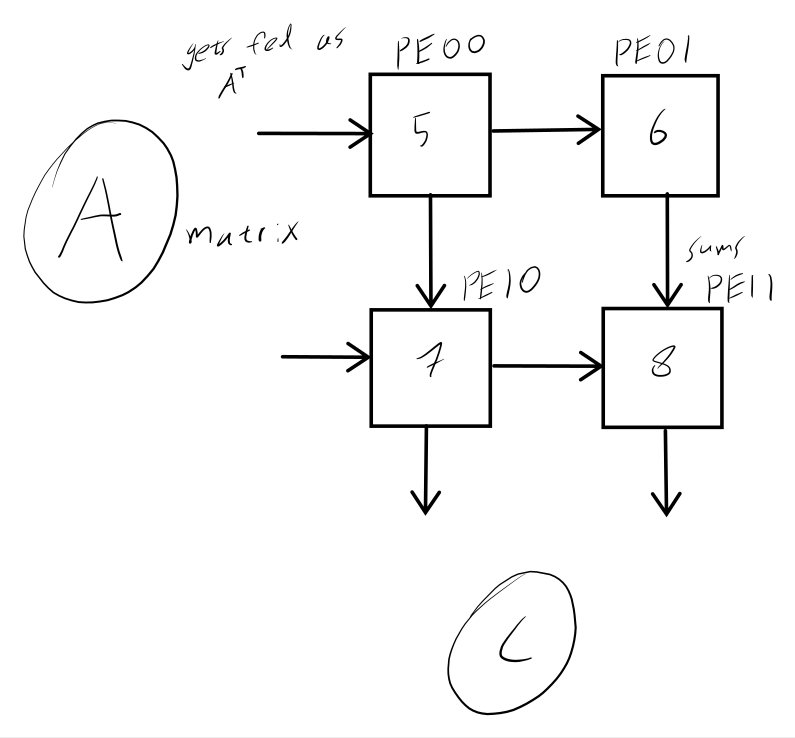
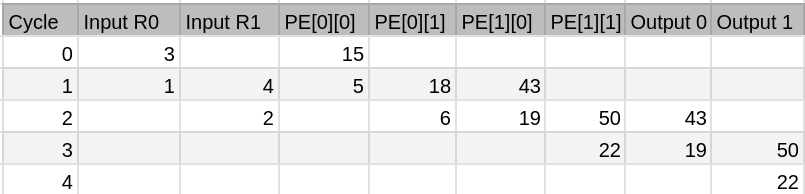

### CMAN5

A)

B)

C) \
	* there are 8 MACs in total.
	* each input is used twice
	* off chip memory accesses for: \
	A = 4, \
	B = 4, \
	C = 4 \
D) \
 If this were output-stationary, the partial sums would stay fixed in the PEs